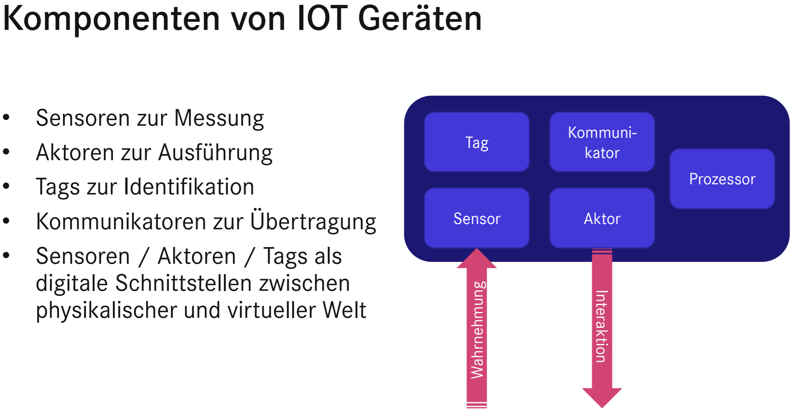

# Willkommen

Das Internet der Dinge (IoT) wächst schnell und vernetzt eine Vielzahl an Geräten.
Die Daten müssen dabei möglichst effizient ausgetauscht werden, weil die Ressourcen der IoT-Geräte oft limitiert sind.
Ein viel verwendetes Protokoll, dass diese Aufgabe meisterst, ist das Message Queuing Telemetry Transport (MQTT) Protokoll.
Diese Katacoda gibt einen Überblick über die Funktionsweise des MQTT-Protokolls und demonstriert den Einsatz anhand eines praktischen Beispiels mit HiveMQ [2].

<i style="font-size: 80%">Abbildung 1: Komponenten von IoT Geräten [1].</i>

Eine der fünf Hauptkomponenten eines IoT-Geräts sind die Kommunikatoren (siehe _Abbildung 1_).
Sie stellen die Übertragungsschnittstellen für Daten dar.
Das MQTT-Protokoll setzt darauf auf und nutzt zum Transport der Datenpakete meistens das verbindungsorientierte TCP/IP-Protokoll [3].