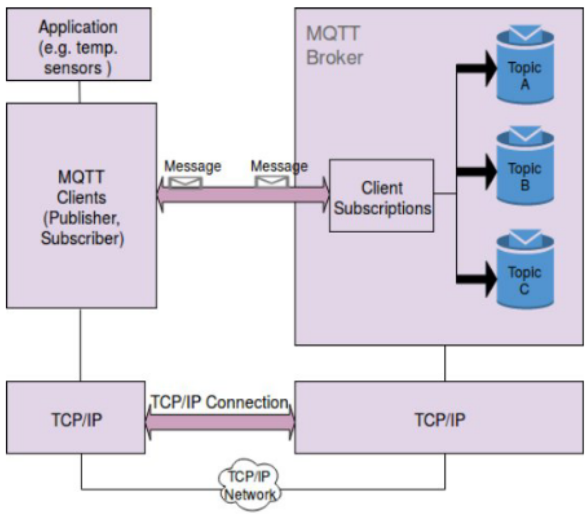
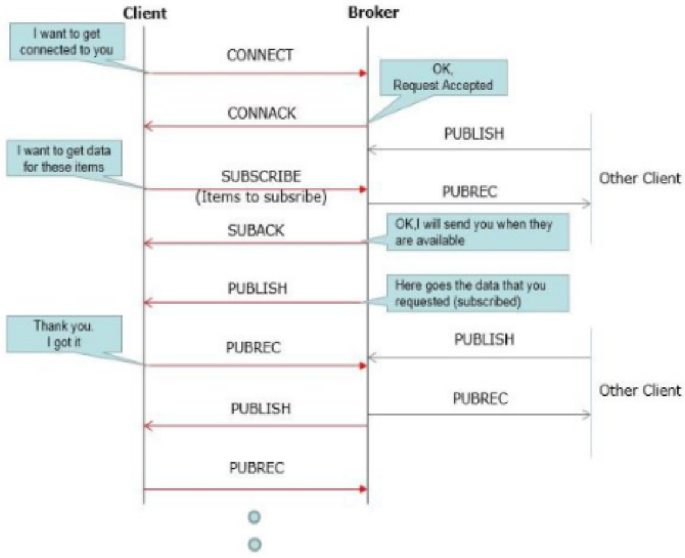
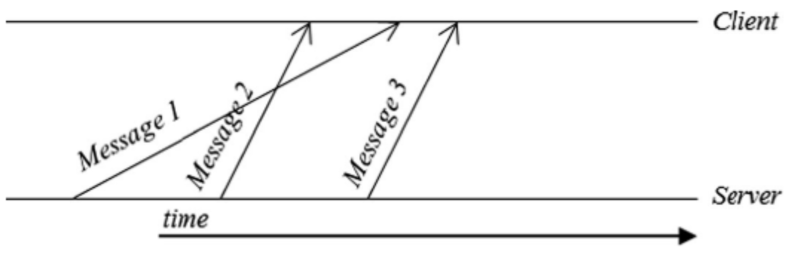
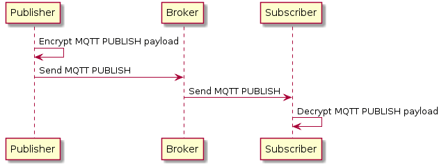
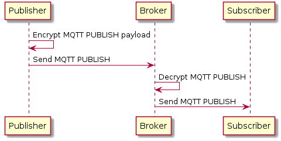

<!-- TODO: Versionen von MQTT (3.1, 5) -->

Das im Jahr 1999 von der IBM entwickelte MQTT-Protokoll ist inzwischen ein offizieller Standard (ISO/IEC 20922, OASIS) für den Nachrichtenaustausch im Internet der Dinge [2] - [5].
Es wurde entwickelt, um Nachrichten in einem Netz mit geringer Bandbreite und langer Netzverzögerung zuverlässig zu übertragen [5], [6].

# Funktionsweise

MQTT ist ein Push-Protokoll, dass über einen Publish/Subscribe-Verfahren verfügt [5], [6].
Ein Abonnent (subscriber) kann bestimmte Themen (topics) abonnieren und erhält dann alle Nachrichten, die für dieses Thema veröffentlicht werden [5], [7].
Die Push-Methode ist der Pull-Methode vorgezogen worden, da sie entstehende Daten ressourcenschonend und ohne Polling direkt verschicken kann [5].

<i style="font-size: 80%">Abbildung 1: Beispiel für die Verwendung von MQTT [8].</i>

In _Abbildung 1_ ist ein Beispiel für die Verwendung von MQTT dargestellt. Der Messwert eines Temperatursensors soll über das Internet der Dinge unterschiedlichen Geräten zur Verfügung gestellt werden. Ist ein neuer Messwert verfügbar, wird dieser an den Broker (Server) geschickt, der diesen wiederum an alle interessierten Subscriber weiterleitet.

<i style="font-size: 80%">Abbildung 2: MQTT Architektur [5].</i>

Die MQTT-Architektur (siehe _Abbildung 2_) basiert auf dem Client-Server-Modell.
Ein Client ist mit dem Server (Broker) verbunden und kann ein Publisher sowie Subscriber sein.
Entsprechend seiner Rollen kann ein Client zum einen Nachrichten veröffentlichen und zum anderen Themen abonnieren und wieder abbestellen [5].

Die Hauptaufgabe eines Brokers ist das Verteilen von Nachrichten.
Dafür muss der Broker alle Nachrichten, die er von den Publishern erhält, filtern und an alle interessierten Subscriber verschicken.
Zusätzlich werden die Nachrichten von einem Broker für eine bestimmte Zeit aufbewahrt, um diese an neue Subscriber eines Themas verteilen zu können [5].

<i style="font-size: 80%">Abbildung 3: Exemplarischer Nachrichtenaustausch eines MQTT-Netzwerks [5].</i>

In _Abbildung 3_ ist ein Nachrichtenaustausch eines MQTT-Netzwerks einmal exemplarisch dargestellt.
Bevor ein Client ein Thema abonnieren oder Nachrichten zu einem Thema veröffentlichen kann, muss er eine Verbindung zum Broker aufbauen. Alle Anfragen werden quittiert, um eine zuverlässige Übertragung zu gewährleisten.

<i style="font-size: 80%">Abbildung 4: Exemplarischer Nachrichtenfluss zwischen Client und Server [6].</i>

MQTT kann garantieren, dass jede Nachricht an einen Empfänger zugestellt wird, aber die Reihenfolge der Nachrichten wird nicht garantiert [6].
Ein exemplarischer Nachrichtenfluss zwischen Server und Client ist in _Abbildung 4_ dargestellt und zeigt, dass es
aufgrund von Netzwerkbedingungen zu einer vertauschten Nachrichtenreihenfolge beim Empfänger kommen kann.

|   Level    | Beschreibung                                                                                                                        |
| :--------: | :---------------------------------------------------------------------------------------------------------------------------------- |
| QoS&nbsp;0 | **Höchstens einmal:** Eine Nachricht wird höchstens einmal gesendet und es wird nicht garantiert, dass sie zugestellt wird.         |
| QoS&nbsp;1 | **Mindestens einmal:** Eine Nachricht wird mindestens einmal gesendet und es ist möglich, dass sie mehr als einmal zugestellt wird. |
| QoS&nbsp;2 | **Genau einmal:** Eine Nachricht wird genau einmal mit Hilfe eines 4-Wege-Handshakes zugestellt.                                    |

<i style="font-size: 80%">Tabelle1: Übertragungsqualitäten des MQTT-Protokolls [5], [6].</i>

Das MQTT-Protokoll hat verschiedene Level von Übertragungsqualitäten (Quality of Service, QoS) definiert: Dabei handelt es sich um unterschiedliche Garantien bezüglich der Zustellung von Nachrichten, die zwischen Sender und Empfänger vereinbart werden können [5], [6].
Es gibt drei Level von Übertragungsqualitäten, die in _Tabelle 1_ aufgeführt sind.
Verschiedene Prioritäten von Nachrichten sind im MQTT-Protokoll allerdings nicht vorgesehen [5].

Ein Client kann bezogen auf ein Thema einen "letzten Willen" dem Broker mitteilen. Im Fall eines unerwarteten Verbindungsabbruchs des Clients wird sein "letzter Wille" bezüglich eines Themas allen Abonnenten mitgeteilt [5].

# Sicherheit

MQTT sieht zwei verschiedene Verschlüsselungsmethoden vor: Zum einen die Ende-zu-Ende- und zum anderen die Client-zu-Broker-Verschlüsselung.
Metadaten werden bei MQTT grundsätzlich nicht verschlüsselt, da diese zur Verteilung der Nachrichten vom Broker verwendet werden müssen.
Nur die Nutzdaten (Payload) können verschlüsselt übertragen werden.

<i style="font-size: 80%">Abbildung 5: Ende-zu-Ende-Verschlüsselung im MQTT-Protokoll [9].</i>

Bei der Ende-zu-Ende-Verschlüsselung (siehe _Abbildung 5_) werden die Nutzdaten einer Nachricht beim Versender verschlüsselt und erst beim Empfänger wieder entschlüsselt. Dadurch ist es weder dem Broker noch anderen Parteien, die beim Datenaustausch mitlesen können, möglich den Inhalt der Nachricht zu erfahren.

<i style="font-size: 80%">Abbildung 6: Client-zu-Broker-Verschlüsselung im MQTT-Protokoll [9].</i>

Wenn die Nachrichten nur auf dem Weg vom Publisher zum Broker vor dem Abhören geschützt sein sollen, eignet sich die Client-zu-Broker-Verschlüsselung (siehe _Abbildung 6_).