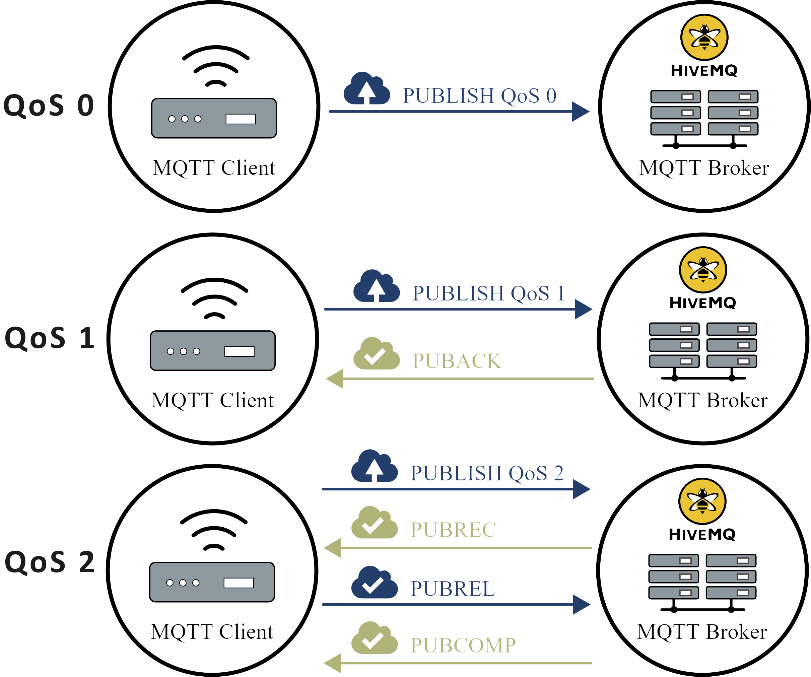
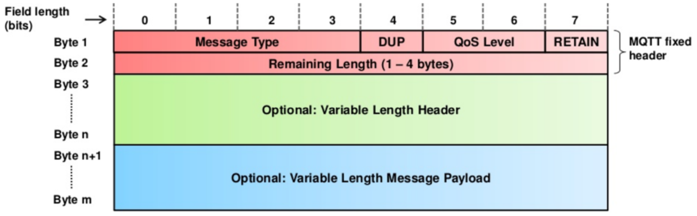

Das im Jahr 1999 von der IBM entwickelte MQTT-Protokoll ist inzwischen ein offizieller Standard (ISO/IEC 20922, OASIS) für den Nachrichtenaustausch im Internet der Dinge [2] - [5].
Es wurde entwickelt, um Nachrichten in einem Netz mit geringer Bandbreite und langer Netzverzögerung zuverlässig zu übertragen [5], [6].

# Funktionsweise

MQTT ist ein Push-Protokoll, dass über ein Publish/Subscribe-Verfahren verfügt [5], [6].
Ein Abonnent (subscriber) kann bestimmte Themen (topics) abonnieren und erhält dann alle Nachrichten, die für diese Themen veröffentlicht werden [5], [7].
Die Push-Methode ist der Pull-Methode vorgezogen worden, da sie entstehende Daten ressourcenschonend und ohne Polling direkt verschicken kann [5].

<i style="font-size: 80%">Abbildung 1: Beispiel für die Verwendung von MQTT [8].</i>

In _Abbildung 1_ ist ein Beispiel für die Verwendung von MQTT dargestellt. Der Messwert eines Temperatursensors soll unterschiedlichen Geräten zur Verfügung gestellt werden. Ist ein neuer Messwert verfügbar, wird dieser an den MQTT-Broker (Server) geschickt, der diesen wiederum an alle interessierten Subscriber weiterleitet.

Die MQTT-Architektur (siehe _Abbildung 2_) basiert auf dem Client-Server-Modell.

<i style="font-size: 80%">Abbildung 2: MQTT Architektur [5].</i>

Ein Client ist mit dem MQTT-Broker verbunden und kann ein Publisher sowie Subscriber sein.
Entsprechend seiner Rollen kann ein Client zum einen Nachrichten veröffentlichen und zum anderen Themen abonnieren und wieder abbestellen [5].

Die Hauptaufgabe eines MQTT-Brokers ist das Verteilen von Nachrichten.
Dafür muss der MQTT-Broker alle Nachrichten, die er von den Publishern erhält, filtern und an alle interessierten Subscriber verschicken.
Ein MQTT-Broker speichert keine Nachrichten ab oder hält sie vor [5].

<i style="font-size: 80%">Abbildung 3: Exemplarischer Nachrichtenaustausch eines MQTT-Netzwerks [5].</i>

In _Abbildung 3_ ist ein Nachrichtenaustausch eines MQTT-Netzwerks einmal exemplarisch dargestellt.
Bevor ein Client ein Thema abonnieren oder Nachrichten zu einem Thema veröffentlichen kann, muss er eine Verbindung zum MQTT-Broker aufbauen. Alle Anfragen werden quittiert, um eine zuverlässige Übertragung zu gewährleisten [5].

<i style="font-size: 80%">Abbildung 4: Exemplarischer Nachrichtenfluss zwischen Client und MQTT-Broker (Server) [6].</i>

MQTT kann garantieren, dass jede Nachricht an einen Empfänger zugestellt wird, aber die Reihenfolge der Nachrichten wird nicht garantiert [6].
Ein exemplarischer Nachrichtenfluss zwischen MQTT-Broker (Server) und Client ist in _Abbildung 4_ dargestellt und zeigt, dass es
aufgrund von Netzwerkbedingungen zu einer vertauschten Nachrichtenreihenfolge beim Empfänger kommen kann.

# Themen

In MQTT werden Themen als UTF-8 Zeichenkette angegeben und können hierarchisch angelegt werden.
Als Trennzeichen für die einzelnen Ebenen wird ein Slash (/) verwendet.
Zusätzlich können Platzhalter für einzelne oder mehrere Ebenen verwendet werden (siehe _Tabelle 1_).

| Platzhalter | Beschreibung                  |
| :---------: | :---------------------------- |
|      +      | Platzhalter für eine Ebene    |
|      #      | Platzhalte für mehrere Ebenen |

<i style="font-size: 80%">Tabelle1: Platzhalter für Ebenen in hierarchischen Themen.</i>

# Übertragungsqualitäten

Das MQTT-Protokoll hat verschiedene Level von Übertragungsqualitäten (Quality of Service, QoS) definiert: Dabei handelt es sich um unterschiedliche Garantien bezüglich der Zustellung von Nachrichten, die zwischen Sender und Empfänger vereinbart werden können [5], [6].

|   Level    | Beschreibung                                                                                                                        |
| :--------: | :---------------------------------------------------------------------------------------------------------------------------------- |
| QoS&nbsp;0 | **Höchstens einmal:** Eine Nachricht wird höchstens einmal gesendet und es wird nicht garantiert, dass sie zugestellt wird.         |
| QoS&nbsp;1 | **Mindestens einmal:** Eine Nachricht wird mindestens einmal gesendet und es ist möglich, dass sie mehr als einmal zugestellt wird. |
| QoS&nbsp;2 | **Genau einmal:** Eine Nachricht wird genau einmal mit Hilfe eines 4-Wege-Handshakes zugestellt.                                    |

<i style="font-size: 80%">Tabelle 2: Übertragungsqualitäten des MQTT-Protokolls [5], [6].</i>

Es gibt drei Level von Übertragungsqualitäten, die in _Tabelle 2_ aufgeführt sind.
Verschiedene Prioritäten von Nachrichten sind im MQTT-Protokoll allerdings nicht vorgesehen [5].

<i style="font-size: 80%">Abbildung 5: Übertragene Pakete pro Nachrichtenaustausch für die verschiedenen Stufen an Übertragungsqualitäten [9].</i>

_Abbildung 5_ zeigt welche Pakete pro Nachrichtenaustausch für die verschiedenen Stufen an Übertragungsqualitäten verschickt werden.
Für QoS 0 wird lediglich die jeweilige Nachricht verschickt.
Bei QoS 1 quittiert der Empfänger den Eingang der Nachricht.
Der Sender speichert die Nachricht bis er die Quittierung erhalten hat.
Die höchste Stufe der Übertragungsqualität, QoS 2, garantiert mit Hilfe eines 4-Wege-Handshakes dem Sender und Empfänger, dass die Nachricht genau ein einziges Mal zugestellt wurde [9].

# Nachrichten

Nachrichten des MQTT-Protokolls haben einen geringen Overhead, um Bandbreite zu sparen und für jedes Gerät im Internet der Dinge verwendbar zu sein.

<h2 id="aufbau" style="font-size: 120%;">Aufbau</h2>

In _Abbildung 6_ ist der Aufbau einer MQTT-Nachricht dargestellt. 

<i style="font-size: 80%">Abbildung 6: MQTT Message Header [10].</i>

Das erste Byte ist der feste Header einer MQTT-Nachricht.
Davon entsprechen die ersten vier Bits dem Typ der Nachricht, das fünfte Bit kennzeichnet doppelt gesendete Nachrichten, das sechste und siebte Bit beinhalten die Übertragungsqualität und das achte Bit ist gesetzt, wenn es sich um eine [Retained Message](#retained-message) handelt.
Das zweite Byte ist für den Header mit variabler Länge reserviert. Zusätzlich kann ein optionaler Header, der beispielsweise TLS-Daten für die Verschlüsselung enthält, an dieser Stelle eingefügt werden.
Alle weiteren Bytes einer Nachricht sind für die Daten (Payload) vorgesehen [10].

<h2 id="retained-message" style="font-size: 120%;">Retained Message</h2>

Ist eine Nachricht als _retained_ markiert, dann wird diese vom MQTT-Broker so lange aufbewahrt bis eine neuere Nachricht für das entsprechende Thema verfügbar ist.
Abonniert ein neuer Subscriber das Thema, wird ihm diese Nachricht zugestellt [5].

<h2 id="letzter-wille" style="font-size: 120%;">Letzter Wille</h2>

Ein Client kann bezogen auf ein Thema einen letzten Willen dem MQTT-Broker mitteilen. Im Fall eines unerwarteten Verbindungsabbruchs des Clients wird sein letzter Wille bezüglich eines Themas allen Abonnenten mitgeteilt [5].

# Sicherheit

MQTT sieht zwei verschiedene Verschlüsselungsmethoden vor: Zum einen die Ende-zu-Ende- und zum anderen die Client-zu-Broker-Verschlüsselung.
Metadaten werden bei MQTT grundsätzlich nicht verschlüsselt, da diese zur Verteilung der Nachrichten vom MQTT-Broker verwendet werden müssen.
Nur die Nutzdaten (Payload) können verschlüsselt übertragen werden.

<i style="font-size: 80%">Abbildung 7: Ende-zu-Ende-Verschlüsselung im MQTT-Protokoll [9].</i>

Bei der Ende-zu-Ende-Verschlüsselung (siehe _Abbildung 7_) werden die Nutzdaten einer Nachricht beim Versender verschlüsselt und erst beim Empfänger wieder entschlüsselt.
Nur der Sender und Empfänger verfügen über den Schlüssel, der zur Ver- und Entschlüsselung der Nachricht verwendet wird.
Dadurch ist es weder dem MQTT-Broker noch anderen Parteien, die beim Datenaustausch mitlesen können, möglich den Inhalt der Nachricht zu erfahren [9].

<i style="font-size: 80%">Abbildung 8: Client-zu-Broker-Verschlüsselung im MQTT-Protokoll [9].</i>

Wenn die Nachrichten nur auf dem Weg vom Publisher zum MQTT-Broker vor dem Abhören geschützt sein sollen, eignet sich die Client-zu-Broker-Verschlüsselung (siehe _Abbildung 8_).
In diesem Fall besteht meistens schon eine sichere Verbindung zwischen MQTT-Broker und Subscribern, weshalb die Nachrichten auf diesem Weg nicht zusätzlich verschlüsselt werden müssen [9].