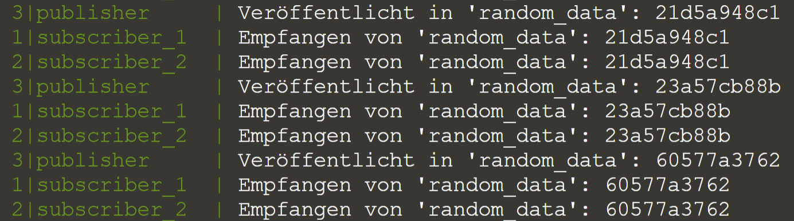
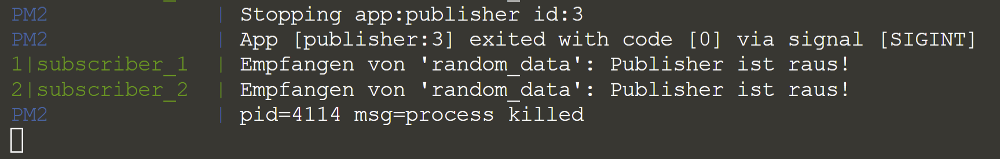

In diesem Beispiel werden die Grundfunktionen eines MQTT-Broker gezeigt.
Es gibt einen Publisher, der zufällige Wörter unter dem Thema `random_data` veröffentlicht.
Zwei Subscriber, die das Thema abonniert haben, empfangen die zufällig generierten Wörter und geben sie auf der Konsole aus.

# Publisher

Der Programmcode des Publishers sieht wie folgt aus:

<pre class="file" data-filename="publisher.js" data-target="replace">
const mqtt = require('mqtt')
const client = mqtt.connect('mqtt://localhost:1883', { will: { topic: 'random_data', payload: 'Publisher ist raus!' } })

client.on('connect', function () {
    setInterval(() => {
        const randomData = (Math.floor(Math.random() * 1e12)).toString(16)
        client.publish('random_data', randomData)
        console.log(`Veröffentlicht in 'random_data': ${randomData}`)
    }, 1e3)
})
</pre>

Zunächst wird die MQTT.js-Bibliothek geladen und eingebunden.
In der zweiten Zeile wird eine neue Verbindung zu dem MQTT-Broker mit der Adresse `localhost` und dem Port `1883` hergestellt.
Als zweites Argument wird ein "letzter Wille" an den MQTT-Broker mit übermittelt: Dieser besagt, dass die Nachricht `Publisher ist raus!` an alle Subscriber des Themas `random_data` geschickt werden soll, wenn die Verbindung unerwartet abbricht.

Sobald die Verbindung zum MQTT-Broker hergestellt ist, startet der Publisher ein Intervall und veröffentlicht jede Sekunde ein zufällig generiertes Wort unter dem Thema `random_data`.

# Subscriber

Der Subscriber ist wie folgt aufgebaut:

<pre class="file" data-filename="subscriber.js" data-target="replace">
const mqtt = require('mqtt')
const client = mqtt.connect('mqtt://localhost:1883')

client.on('connect', function () {
    client.subscribe('random_data')
})

client.on('message', function (topic, message) {
    console.log(`Empfangen von '${topic}': ${message.toString()}`)
})
</pre>

Ähnlich wie der Publisher bindet der Subscriber zunächst die MQTT.js-Bibliothek ein und baut eine Verbindung zum MQTT-Broker auf.
Allerdings gibt er keinen "letzten Willen" an.

Sobald die Verbindung zum MQTT-Broker hergestellt wurde, abonniert der Subscriber das Thema `random_data`.
Wenn eine neue Nachricht ankommt, wird das Thema und der Titel auf der Konsole ausgegeben.

# Ausführung

Die Ausführung des Beispiels erfolgt mit PM2: Es wird eine Instanz des Publishers und zwei Instanzen des Subscribers mit den Namen `subscriber_1` und `subscriber_2` gestartet.

`pm2 start publisher.js
pm2 start subscriber.js --name subscriber_1
pm2 start subscriber.js --name subscriber_2`{{execute T1}}

Anschließend kann über folgenden Befehl die Ausgabe aller Instanzen verfolgt werden:

`pm2 logs`{{execute T1}}

    
🛈 PM2-Monitoring (optional)

    
Optional kann eine Übersicht aller laufenden Instanzen unter PM2 mit dem Befehl <code class="execute T3" title="Run command">pm2 monit</code> angezeigt werden.

Die Ausgabe des PM2-Logs ist in _Abbildung 7_ exemplarisch dargestellt.

<i style="font-size: 80%">Abbildung 7: Exemplarische Ausgabe des PM2-Logs.</i>

# "Letzter Wille"

Mit dem folgendem Befehl wird die Instanz des Publishers beendet.
Damit wird in diesem Fall der Ausfall des Publishers simuliert, um die Übermittlung des "letzten Willens" zu demonstrieren.

`pm2 delete publisher`{{execute T2}}

Wenn der Publisher nicht mehr mit dem MQTT-Broker verbunden ist, sendet der MQTT-Broker den "letzten Willen" für jedes Thema an die entsprechenden Subscriber. In _Abbildung 8_ ist die Ausgabe der Subscriber nach dem Beenden des Publishers exemplarisch dargestellt.

<i style="font-size: 80%">Abbildung 8: Exemplarische Ausgabe des PM2-Logs nachdem die Instanz des Publishers beendet wurde.</i>