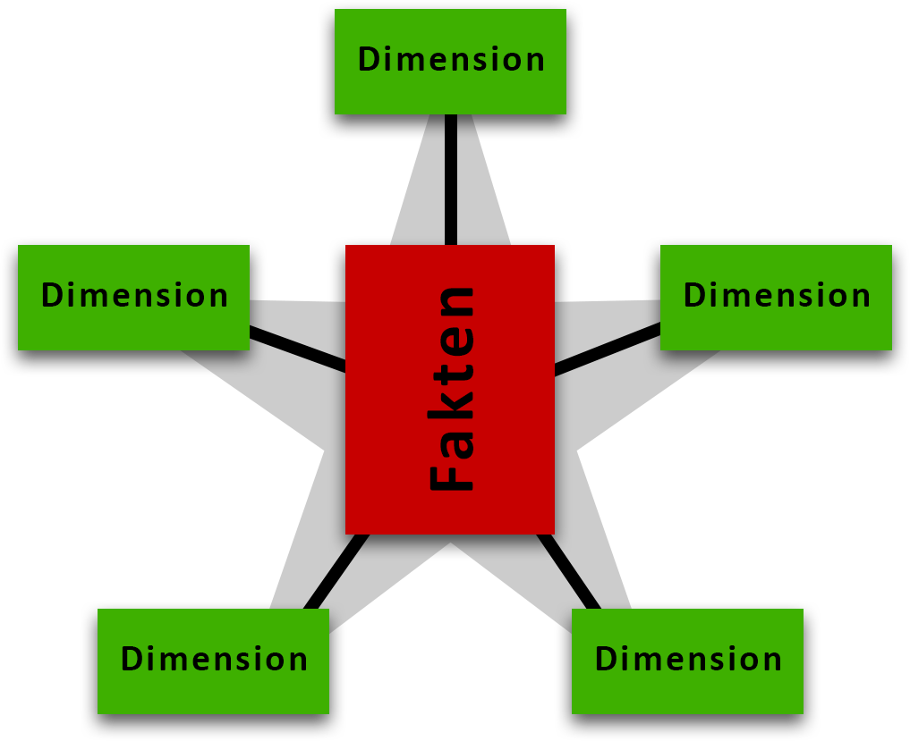
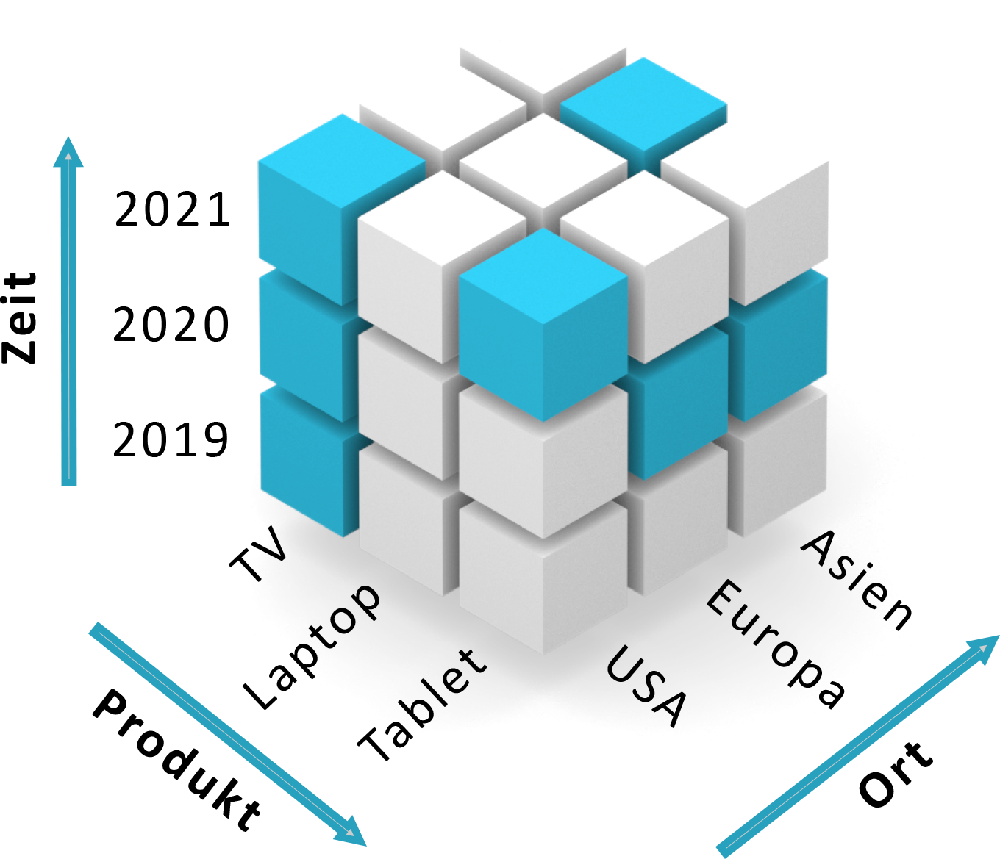

Das Sternschema ist ein Datenbankmodell für Data Warehouses. Es ist in der Lage Anfragen auf große Datenmengen effizient auszuführen [Vavouras2000].

# Aufbau

Bei dem Sternschema gibt es eine zentrale Faktentabelle, die von mehreren Dimensionstabellen umgeben ist. 

Das Sternschema hat seine Bezeichnung von der sternförmigen Anordnung vieler Entitäten um eine zentrale Entität. Die zentrale Entität wird als Faktentabelle und die äußeren Entitäten als Dimensionstabellen bezeichnet. Die Faktentabelle enthält sogenannte Geschäftsereignisse, wie beispielsweise Verkaufstransaktionen oder Anmeldung von Kunden. [Corral2006]

<i style="font-size: 80%">Abbildung 1: Beispiel eines OLAP-Datenwürfels.</i>

# 

Dabei liegt der Fokus vorwiegend auf dem Lesen und nicht dem Schreiben der Daten. [Vavouras2000]

Das Sternschema hat seine Bezeichnung von der sternförmigen Anordnung vieler Entitäten um eine zentrale Entität. Die zentrale Entität wird als Faktentabelle und die äußeren Entitäten als Dimensionstabellen bezeichnet. Die Faktentabelle enthält sogenannte Geschäftsereignisse, wie beispielsweise Verkaufstransaktionen oder Anmeldung von Kunden. [Corral2006] Die Dimensionstabellen ergänzen die Faktentabellen mit beschreibenden Informationen.

<i style="font-size: 80%">Abbildung 2: Beispiel eines OLAP-Datenwürfels.</i>

OLAP ist die Abkürzung für Online Analytical Processing und stellt die Softwarekategorie zur Datenanalyse dar.

OLTP:
- Viele einzelne, normalisierte Tabellen müssen für eine analytische Anfrage miteinander verbunden werden ==> aufwendig
- keine Redundanz
- Echtzeit-Datenverarbeitung

OLAP:
- nicht normalisiert ==> duplizierte Daten können auftreten (Daten werden nicht gelöscht, es wird stattdessen ein neues Tupel mit den geänderten Informationen eingefügt)
- Analyse
- mehrdimensionale Sicht auf die Daten
- integrated Data
- historical Data (Snapshots, not Updates)

Transformierung: Vereinheitlichung und Erstellung von Reports ==> Entscheidung für Geschäftsprozesse 

Star-Schema: Dimensional Data Model (Ralph Kimball Methodology)

Ad-Hoc Abfragen leichter möglich (weniger Joins)

<!-- # Schneeflocken- vs Sternschema -->