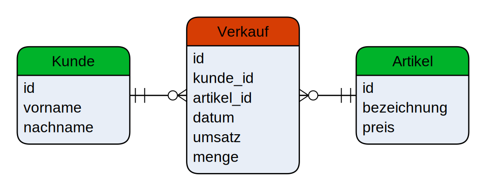

___
Am Beispiel eines einfachen Webshops soll der Unterschied zwischen einem relationalen OLTP- und einem dimensionalen OLAP-System praktisch gezeigt werden.

    
⚠ Vereinfachung

    
Zur Vereinfachung dieses Beispiels werden beide Systeme gemeinsam in einer Datenbank abgebildet. In der Praxis werden dafür unterschiedliche Datenbanken verwendet.

# Relationales Schema

<i style="font-size: 80%">Abbildung 3: Relationales Schema eines einfachen Webshops</i>

In _Abbildung 3_ ist das normalisierte, relationale Schema eines einfachen Webshops dargestellt. 

Der Betreiber des Webshops möchte nun wissen, welche seine treusten Kunden im Jahr 2021 waren.
Dafür benötigt er eine **Liste der summierten Umsätze pro Kunde für das Jahr 2021**.
Die entsprechende Abfrage im OLTP-System sieht wie folgt aus:

`SELECT
    Kunde.vorname,
    COALESCE(SUM(preis * menge), 0) AS umsatz
FROM Kunde
LEFT JOIN Bestellung
    ON Bestellung.kunde_id = Kunde.id
LEFT JOIN Position
    ON Position.bestellung_id = Bestellung.id
LEFT JOIN Artikel
    ON Artikel.id = Position.artikel_id
WHERE EXTRACT(year FROM datum) = 2021 OR datum IS NULL
GROUP BY Kunde.id
ORDER BY umsatz DESC;`{{execute}}

    
🛈 Coalesce-Funktion in Postgres

    
Die Coalesce-Funktion in Postgres gibt das erste Argument, das nicht NULL ist, zurück. Dadurch können NULL-Werte in Abfragen beispielsweise durch Default-Werte ersetzt werden.

Folgendes Ergebnis sollte bei der Abfrage heraus kommen:

| vorname | umsatz |
| :------ | -----: |
| Paula   |  18.79 |
| Paul    |  11.85 |
| Peter   |      0 |

Um dieses Ergebnis zu erhalten, müssen alle Tabellen des Webshops miteinander verbunden werden: Dafür sind drei Joins notwendig.
Mit steigender Komplexität eines solchen OLTP-Systems nimmt auch die Anzahl an Joins für analytische Abfragen zu.
Für diese Abfrage muss zudem für jede Position der Umsatz aus Preis und Menge berechnet werden.

# Sternschema

Mit dem Sternschema kann die Analyse der Daten effizienter und intuitiver durchgeführt werden.
In _Abbildung 4_ ist ein vereinfachtes Sternschema für das Beispiel des Webshops abgebildet.
Die rot markierte Tabelle ist die Faktentabelle mit den Umsätzen der verkauften Artikel und die grün markierten Tabellen sind die Dimensionstabellen.
Die Dimensionstabellen entsprechen in diesem Fall eins zu eins den Tabellen aus dem OLTP-System.

 
<i style="font-size: 80%">Abbildung 4: Dimensionales Sternschema für ein vereinfachten Data Warehouses des Webshops. Die rot markierte Tabelle ist die Faktentabelle, die grün markierten Tabellen sind die Dimensionstabellen.</i>

Der folgende SQL-Befehl holt die entsprechenden Daten aus dem fiktiven OLTP-System des Webshops und schreibt sie in das nach dem Sternschema definierte Datawarehouse.

`INSERT INTO Verkauf(kunde_id, artikel_id, datum, umsatz, menge)
SELECT kunde_id, artikel_id, datum, preis * menge AS umsatz, menge FROM Kunde
RIGHT JOIN Bestellung ON Bestellung.kunde_id = Kunde.id
LEFT JOIN Position ON Position.bestellung_id = Bestellung.id
LEFT JOIN Artikel ON Artikel.id = Position.artikel_id;`{{execute}}

Die Faktentabelle des Datawarehouses sollte nun sechs Einträge beinhalten:

`SELECT * FROM Verkauf;`{{execute}}

Die Abfrage **der summierten Umsätze pro Kunde für das Jahr 2021** sieht im Datawarehouse jetzt wie folgt aus:

`SELECT Kunde.vorname, COALESCE(SUM(umsatz), 0) AS umsatz FROM Verkauf
FULL JOIN Kunde on Kunde.id = Verkauf.kunde_id
WHERE EXTRACT(year FROM datum) = 2021 OR datum IS NULL
GROUP BY Kunde.id
ORDER BY umsatz DESC;`{{execute}}

Es ist im Vergleich zum OLTP-System nur noch ein Join mit der Dimensionstabelle Kunde nötig. Zudem entfällt die Berechnung des Umsatzes. Insgesamt ist diese analytische Abfrage im Datawarehouse effizienter in der Ausführung und intuitiv verständlicher für Anwender.